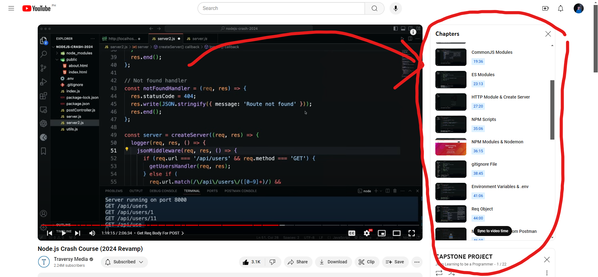

# jogo-learning-node-js

## Learned this from  [Traversy Media - Node.js Crash Course (2024 Revamp)](https://youtu.be/32M1al-Y6Ag?si=R9SnSn-UkY6VlISX)

### Timestamps:
0:00 - Intro & Slides
12:18 - Installation
13:22 - Node REPL
15:05 - Setup & package.json Init
16:51 - Running JavaScript Files
19:36 - CommonJS Modules
23:13 - ES Modules
27:20 - HTTP Module & Create Server
35:06 - NPM Scripts
36:15 - NPM Modules & Nodemon
38:45 - .gitignore File
41:06 - Environment Variables & .env
44:00 - Req Object
46:10 - Marking Requests From Postman
47:28 - Simple Routing
51:52 - Loading Files
59:45 - Building a Simple API
1:10:27 - Middleware
1:13:24 - Cleanup (Middleware & Handlers)
1:19:08 - Get Req Body For POST
1:24:20 - File System Module
1:33:43 - Path Module
1:39:50 - OS Module
1:42:13 - URL Module
1:47:46 - Crypto Module
1:54:08 - Emitting Events
1:59:04 - Process Object

## Files are chapters from YT Video

